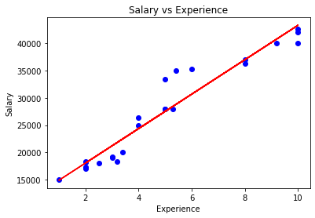
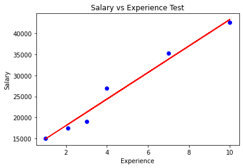
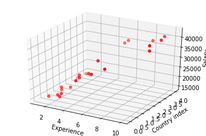

```python
import pandas as pd
import matplotlib.pyplot as plt
from sklearn.model_selection import train_test_split
from sklearn.linear_model import LinearRegression 
```


```python
# Utilizamos el CSV salarios proveídos por Platzi
dataset = pd.read_csv('salarios.csv')
dataset.head()
```


<div>
<style scoped>
    .dataframe tbody tr th:only-of-type {
        vertical-align: middle;
    }

    .dataframe tbody tr th {
        vertical-align: top;
    }

    .dataframe thead th {
        text-align: right;
    }
</style>
<table border="1" class="dataframe">
  <thead>
    <tr style="text-align: right;">
      <th></th>
      <th>Aexperiencia</th>
      <th>Salario</th>
    </tr>
  </thead>
  <tbody>
    <tr>
      <th>0</th>
      <td>10.0</td>
      <td>42500</td>
    </tr>
    <tr>
      <th>1</th>
      <td>8.0</td>
      <td>36302</td>
    </tr>
    <tr>
      <th>2</th>
      <td>5.4</td>
      <td>35000</td>
    </tr>
    <tr>
      <th>3</th>
      <td>2.5</td>
      <td>18103</td>
    </tr>
    <tr>
      <th>4</th>
      <td>1.0</td>
      <td>15000</td>
    </tr>
  </tbody>
</table>
</div>


```python
dataset.shape
```


    (30, 2)


```python
# Dividiendo el set de datos para entrenar y probar
x = dataset.iloc[:, :-1].values
y = dataset.iloc[:, 1].values
print(x)
print(y)
```

    [[10. ]
     [ 8. ]
     [ 5.4]
     [ 2.5]
     [ 1. ]
     [ 8. ]
     [ 4. ]
     [ 6. ]
     [ 2. ]
     [10. ]
     [ 4. ]
     [ 7. ]
     [ 3. ]
     [ 5. ]
     [ 2. ]
     [ 5. ]
     [ 3. ]
     [ 2. ]
     [ 3. ]
     [ 2. ]
     [ 5. ]
     [ 3.4]
     [ 5.3]
     [ 2.1]
     [ 9.2]
     [10. ]
     [ 3.2]
     [10. ]
     [ 4. ]
     [ 1. ]]
    [42500 36302 35000 18103 15000 37000 26300 35201 18302 42000 27000 35201
     19201 28000 17000 33402 19000 18200 19000 17301 28000 20000 27900 17500
     40000 42500 18300 40000 25000 15000]


```python
X_train, X_test, Y_train, Y_test = train_test_split(x, y, test_size=0.2, random_state=5)
```


```python
X_train
```


    array([[ 5.4],
           [ 5. ],
           [ 3.2],
           [ 3.4],
           [ 4. ],
           [10. ],
           [ 2. ],
           [ 8. ],
           [ 8. ],
           [10. ],
           [ 3. ],
           [ 5. ],
           [ 2. ],
           [ 9.2],
           [ 6. ],
           [ 1. ],
           [ 2. ],
           [10. ],
           [ 3. ],
           [ 5.3],
           [ 4. ],
           [ 5. ],
           [ 2. ],
           [ 2.5]])


```python
regressor = LinearRegression()
regressor.fit(X_train, Y_train)
```


    LinearRegression(copy_X=True, fit_intercept=True, n_jobs=None, normalize=False)


```python
viz_train = plt
viz_train.scatter(X_train, Y_train, color='blue')
viz_train.plot(X_train, regressor.predict(X_train), color='red')
viz_train.title('Salary vs Experience')
viz_train.xlabel('Experience')
viz_train.ylabel('Salary')
viz_train.show()
```





```python
viz_train = plt
viz_train.scatter(X_test, Y_test, color='blue')
viz_train.plot(X_train, regressor.predict(X_train), color='red')
viz_train.title('Salary vs Experience Test')
viz_train.xlabel('Experience')
viz_train.ylabel('Salary')
viz_train.show()
```





```python
regressor.score(X_test, Y_test)
# Este método nos devuelve un número entre 0 y 1, es la probabilidad de predecir correctamente los datos de prueba
```


    0.9747410412322155


## Reto
Añade una columna más que incluya el país del programador, y averigua o predice qué tan bien se ajustan estos datos.


```python
import random
countries = ['MX', 'COL', 'USA', 'CHI', 'AR']
def pais():
    index_countries = [0,1,2,3,4]
    return random.choice(index_countries)
```


```python
dataset['pais'] = ''
for i in range(len(dataset)):
    dataset['pais'][i] = pais()
dataset.head(10)
```

    /usr/local/lib/python3.7/dist-packages/ipykernel_launcher.py:3: SettingWithCopyWarning: 
    A value is trying to be set on a copy of a slice from a DataFrame
    
    See the caveats in the documentation: https://pandas.pydata.org/pandas-docs/stable/user_guide/indexing.html#returning-a-view-versus-a-copy
      This is separate from the ipykernel package so we can avoid doing imports until


<div>
<style scoped>
    .dataframe tbody tr th:only-of-type {
        vertical-align: middle;
    }

    .dataframe tbody tr th {
        vertical-align: top;
    }

    .dataframe thead th {
        text-align: right;
    }
</style>
<table border="1" class="dataframe">
  <thead>
    <tr style="text-align: right;">
      <th></th>
      <th>Aexperiencia</th>
      <th>Salario</th>
      <th>pais</th>
    </tr>
  </thead>
  <tbody>
    <tr>
      <th>0</th>
      <td>10.0</td>
      <td>42500</td>
      <td>2</td>
    </tr>
    <tr>
      <th>1</th>
      <td>8.0</td>
      <td>36302</td>
      <td>0</td>
    </tr>
    <tr>
      <th>2</th>
      <td>5.4</td>
      <td>35000</td>
      <td>4</td>
    </tr>
    <tr>
      <th>3</th>
      <td>2.5</td>
      <td>18103</td>
      <td>3</td>
    </tr>
    <tr>
      <th>4</th>
      <td>1.0</td>
      <td>15000</td>
      <td>3</td>
    </tr>
    <tr>
      <th>5</th>
      <td>8.0</td>
      <td>37000</td>
      <td>4</td>
    </tr>
    <tr>
      <th>6</th>
      <td>4.0</td>
      <td>26300</td>
      <td>1</td>
    </tr>
    <tr>
      <th>7</th>
      <td>6.0</td>
      <td>35201</td>
      <td>1</td>
    </tr>
    <tr>
      <th>8</th>
      <td>2.0</td>
      <td>18302</td>
      <td>1</td>
    </tr>
    <tr>
      <th>9</th>
      <td>10.0</td>
      <td>42000</td>
      <td>3</td>
    </tr>
  </tbody>
</table>
</div>


```python
dataset = dataset[['Aexperiencia', 'pais', 'Salario']]
dataset.head(5)
```


<div>
<style scoped>
    .dataframe tbody tr th:only-of-type {
        vertical-align: middle;
    }

    .dataframe tbody tr th {
        vertical-align: top;
    }

    .dataframe thead th {
        text-align: right;
    }
</style>
<table border="1" class="dataframe">
  <thead>
    <tr style="text-align: right;">
      <th></th>
      <th>Aexperiencia</th>
      <th>pais</th>
      <th>Salario</th>
    </tr>
  </thead>
  <tbody>
    <tr>
      <th>0</th>
      <td>10.0</td>
      <td>2</td>
      <td>42500</td>
    </tr>
    <tr>
      <th>1</th>
      <td>8.0</td>
      <td>0</td>
      <td>36302</td>
    </tr>
    <tr>
      <th>2</th>
      <td>5.4</td>
      <td>4</td>
      <td>35000</td>
    </tr>
    <tr>
      <th>3</th>
      <td>2.5</td>
      <td>3</td>
      <td>18103</td>
    </tr>
    <tr>
      <th>4</th>
      <td>1.0</td>
      <td>3</td>
      <td>15000</td>
    </tr>
  </tbody>
</table>
</div>


```python
# Dividiendo el set de datos para entrenar y probar
x = dataset.iloc[:, :-1].values
y = dataset.iloc[:, -1].values
```


```python
X_train, X_test, Y_train, Y_test = train_test_split(x, y, test_size=0.2, random_state=5)
```


```python
X_train
```


    array([[5.4, 4],
           [5.0, 0],
           [3.2, 0],
           [3.4, 0],
           [4.0, 1],
           [10.0, 2],
           [2.0, 3],
           [8.0, 4],
           [8.0, 0],
           [10.0, 2],
           [3.0, 1],
           [5.0, 1],
           [2.0, 0],
           [9.2, 4],
           [6.0, 1],
           [1.0, 3],
           [2.0, 1],
           [10.0, 3],
           [3.0, 0],
           [5.3, 1],
           [4.0, 1],
           [5.0, 4],
           [2.0, 1],
           [2.5, 3]], dtype=object)


```python
regressor = LinearRegression()
regressor.fit(X_train, Y_train)
```


    LinearRegression(copy_X=True, fit_intercept=True, n_jobs=None, normalize=False)


```python
Y_train
```


    array([35000, 28000, 18300, 20000, 25000, 42500, 18200, 37000, 36302,
           40000, 19201, 28000, 17301, 40000, 35201, 15000, 18302, 42000,
           19000, 27900, 26300, 33402, 17000, 18103])


```python
fig = plt.figure()
ax = fig.add_subplot(111, projection='3d')

X = [x[0] for x in X_train]
Y = [y[1] for y in X_train]

ax.scatter(X,Y,Y_train, c='r', marker='o')
ax.set_xlabel('Experience')
ax.set_ylabel('Country index')
ax.set_zlabel('Salary')
```


    Text(0.5, 0, 'Salary')





```python
regressor.score(X_test, Y_test)
```


    0.9372541585022335


